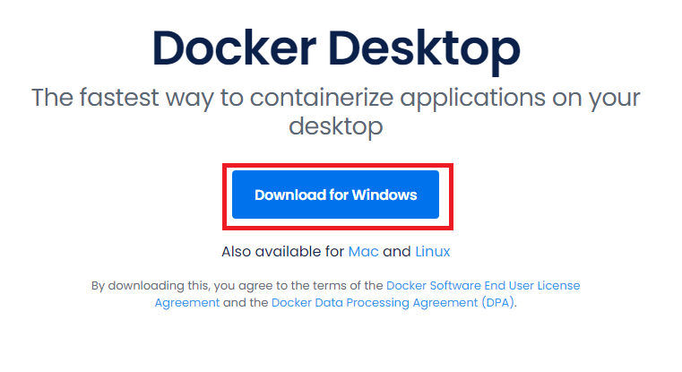
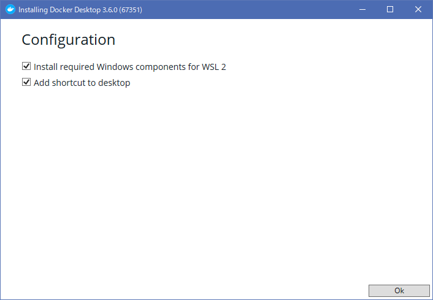
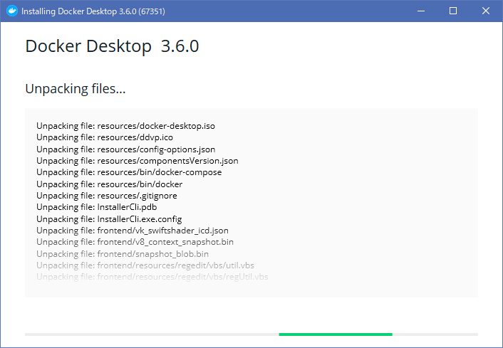
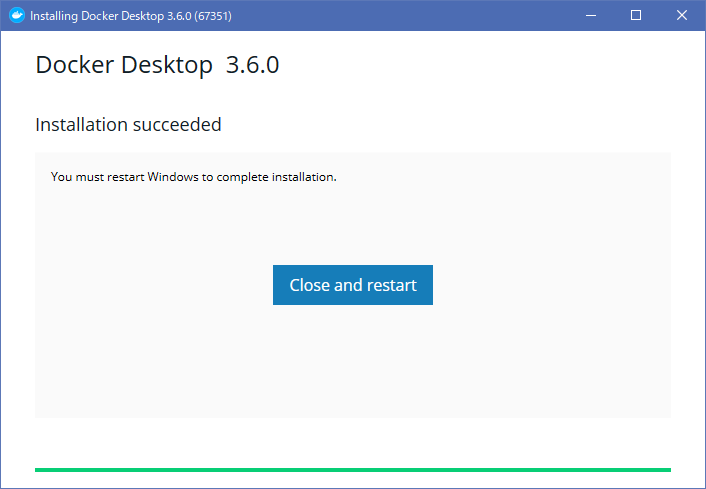

# Docker Desktop インストール

<https://www.docker.com/products/docker-desktop>

## インストール (Windows)

### WSL2 のインストール

参考：<https://docs.microsoft.com/ja-jp/windows/wsl/install-win10>

#### Linux 用 Windows サブシステムを有効にする

管理者として PowerShell を開き、以下を実行します。

```sh
dism.exe /online /enable-feature /featurename:Microsoft-Windows-Subsystem-Linux /all /norestart
```

#### 仮想マシンの機能を有効にする

管理者として PowerShell を開き、以下を実行します。

```sh
dism.exe /online /enable-feature /featurename:VirtualMachinePlatform /all /norestart
```

Windows を再起動します。

#### Linux カーネル更新プログラムをパッケージをインストールする

##### ダウンロード

<https://wslstorestorage.blob.core.windows.net/wslblob/wsl_update_x64.msi>

##### インストール

そのままインストーラを実行します。

#### WSL2 を既定のバージョンとして設定する

PowerShell を開いて、以下のコマンドを実行します。

```sh
wsl --set-default-version 2
```

### インストーラのダウンロード

<https://www.docker.com/products/docker-desktop>



### インストーラ起動



そのまま OK をクリックします。

### インストール中



この処理は結構長いです。

### インストール完了



Close and restart をクリックし、Windows を再起動します。
